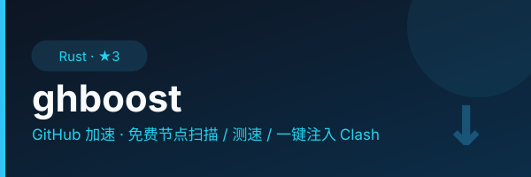

<div align="center">
  
</div>

<p align="center">
  <a href="https://github.com/lilyco-42/ghboost/actions/workflows/tray.yml"></a>
  <a href="https://github.com/lilyco-42/ghboost/actions/workflows/build-all.yml"></a>
  <a href="https://github.com/lilyco-42/ghboost/actions/workflows/ci.yml"></a>
  <a href="https://github.com/lilyco-42/ghboost/releases/latest"></a>
  <a href="LICENSE"></a>
</p>

# ghboost

一鍵加速 Google / YouTube / GitHub 的 Windows 桌面工具。

> **不想看指令？** 直接 [下載桌面版](https://github.com/lilyco-42/ghboost/releases/latest)
> 或看 [產品頁](https://lilyco-42.github.io/ghboost/)。

## 這是什麼

ghboost 是一個 Windows 系統託盤工具。裝好之後，托盤上會多一個圖示——
點一下按鈕就開 Google / YouTube / GitHub，再點一下就關。

**不需要懂代理、不需要碰命令列、不需要改系統設定。**

### 三種模式

| 模式 | 適合誰 | 怎麼用 |
|------|--------|--------|
| **匯入訂閱** | 有自己訂閱網址的人 | 在面板貼上訂閱 URL，ghboost 自動拉取節點並啟動 |
| **自帶節點** | 有單獨 vless/vmess/trojan/ss 連結的人 | 在面板貼上連結，ghboost 自動解析 |
| **掃描免費節點（命令列）** | 想自己找公開節點的人 | 用核心命令列 `ghboost scan` 掃描、測速、自動選最快的（見下方「CLI 工具」） |

> 沒有節點？我們也提供 [節點訂閱服務](https://lain42.top/panel/redeem)，
> 買一組卡密、貼回面板就能用。**客戶端本身永遠免費開源**，不買節點也不會少任何功能。

## 下載安裝

### 方式一：直接下載（推薦）

到 [Releases](https://github.com/lilyco-42/ghboost/releases/latest) 下載
`ghboost-tray-windows-x64.zip`，解壓到任意目錄，**雙擊 `install.bat`** 即可。
（`.ps1` 在 Windows 上雙擊預設是用記事本打開，跑不起來的 —— `install.bat`
就是為這件事存在的。）

安裝腳本會：
- 建立桌面捷徑
- 設定開機自動啟動
- 裝好 mihomo 內核：**直接用包裡 `kernel\` 那份，不聯網**
  （要升級內核才加 `-WithKernel` 強制重新下載）

### 方式二：從原始碼編譯

```bash
# 需要 Rust 1.98+（CI 用的版本）和 PowerShell
git clone https://github.com/lilyco-42/ghboost.git
cd ghboost/ghboost-tray
cargo build --release
# 安裝
powershell -ExecutionPolicy Bypass -File tools/install.ps1 -WithKernel
```

## 怎麼用

1. **啟動**：安裝後桌面會有捷徑，或在 `ghboost-tray\` 目錄下雙擊 `ghboost-tray.exe`
2. **託盤圖示**：系統託盤（右下角）會出現 ghboost 圖示
   - 🟢 綠色 = 正在加速
   - 🔴 紅色 = 已關閉
3. **開啟面板**：右鍵托盤圖示 →「開啟面板」，或直接在瀏覽器訪問 `http://127.0.0.1:8619`
   （埠號從 8619 開始往上找第一個空閒的；實際埠號寫在 `%LOCALAPPDATA%\ghboost\console.port`）
4. **選模式**：
   - 有訂閱網址 → 貼到「匯入訂閱」欄位 → 點「開啟代理」
   - 已經在用 Clash Verge / v2rayN → 切到「用現成代理」，填它的埠號 → 點「開啟代理」
   - 都沒有 → 到 [節點訂閱服務](https://lain42.top/panel/redeem) 買一組卡密，或用核心命令列 `ghboost scan` 自己找公開節點（進階）
5. **完成**：瀏覽器訪問 google.hk / youtube.com / github.com 確認能開

### 一鍵加速按鈕

面板正中間有一個大按鈕：
- 點一下 → 啟動 mihomo 內核 + 設定系統代理 → 按鈕變綠
- 再點一下 → 關閉代理 + 停止內核 → 按鈕變紅

就這樣。不用碰任何設定。

## CLI 工具（進階用戶）

ghboost 也提供命令列工具，適合想在伺服器上跑或自動化的人：

```bash
# 掃描免費節點
ghboost scan --max-sources 100 --concurrency 32

# 測速
ghboost test --top 300 --timeout-ms 8000

# 匯出最優節點
ghboost add --keep 20 --apply

# GitHub hosts 加速
ghboost boost      # 開始
ghboost unboost    # 還原

# 一鍵部署代理伺服器（SSH 遠程部署）
ghboost deploy 1.2.3.4 --password xxx --protocol vless-reality
```

> 完整 CLI 參數見 `ghboost --help`，或[文檔](docs/)。

## 架構

```
ghboost/
├── ghboost-tray/        # Windows 桌面托盤應用（主產品）
│   ├── src/
│   │   ├── main.rs      # 托盤 + Win32 消息泵
│   │   └── panel.html   # 面板（繁中，零外部請求）
│   └── tools/
│       ├── install.ps1  # 安裝腳本（預設用隨包內核，不聯網）
│       └── install.bat  # 雙擊入口（.ps1 雙擊只會被記事本打開）
├── kernel/              # 打包時由 CI 放入（repo 不存二進制）
├── src/                 # CLI 核心（scan/test/add/boost/deploy）
│   ├── main.rs          # CLI 入口
│   ├── lib.rs           # 模塊宣告 + C ABI FFI
│   ├── hosts.rs         # GitHub 加速
│   ├── nodes.rs         # 節點掃描/測速/匯出
│   ├── proxy.rs         # 跨平台代理設定
│   ├── mihomo.rs        # Mihomo 內核管理
│   ├── deploy.rs        # SSH 遠程部署
│   └── web.rs           # 訂閱配置生成
├── ghboost-ffi/         # FFI crate（JNI + iOS）
├── ghboost-android/     # Android 專案
├── docs/
│   └── index.html       # 產品首頁（GitHub Pages）
└── Cargo.toml
```

## 商業模式

- **客戶端**：免費、開源（MIT），不設功能付費牆。
- **節點訂閱**：可選的付費服務。買了就有現成訂閱網址可貼；
  不買也能用自己的訂閱或掃描免費節點。兩者互不依賴。
- 詳見 [CONTRIBUTING.md](CONTRIBUTING.md) 的「商業模式與誰擁有什麼」。

## 支援的協議

| 協議 | 掃描 | 測速 | 自帶連結 | 部署 |
|------|------|------|---------|------|
| VLESS-Reality | ✅ | ✅ | ✅ | ✅ |
| VLESS-WS | ✅ | ✅ | ✅ | ✅ |
| VMess | ✅ | ✅ | ✅ | — |
| Trojan | ✅ | ✅ | ✅ | ✅ |
| Shadowsocks | ✅ | ✅ | ✅ | ✅ |
| Hysteria2 | — | — | ✅ | ✅ |

## 平台支援

| 平台 | 桌面托盤 | CLI |
|------|---------|-----|
| Windows x64 | ✅ 主力 | ✅ |
| macOS ARM64 | — | ✅ |
| Linux x64 | — | ✅ |
| Android ARM64 | — | ✅ (VpnService) |
| macOS x64 | — | ✅ |
| Linux ARM64 | — | ✅ |
| Windows ARM64 | — | ✅ |

> 桌面托盤版目前只支援 Windows。macOS/Linux 用 CLI。

## CI/CD

使用 GitHub Actions：
- **tray.yml**：編譯 Windows 托盤二進制 + 上傳 Release
- **build-all.yml**：8 平台 CLI 二進制 + MSI；**tag push 時自動建立 Release**
- **ci.yml**：lint + test

## 依賴

- **Rust** 1.98+（CI 釘 1.98.1，避免 rustfmt 小版本漂移讓 CI 無徵兆飄紅）
- **mihomo** v1.19+（內核，託管下載或 bundle 自帶）
- **PowerShell**（安裝腳本用）

## 授權

MIT（見 [LICENSE](LICENSE)）。

執行期以獨立子進程調用的 mihomo 內核遵循 GPL-3.0。兩者構成聚合體
（aggregate）—— mihomo 未被鏈接進本項目的二進制文件，因此不影響本項目的
MIT 授權。詳見 [THIRD-PARTY-NOTICES.md](THIRD-PARTY-NOTICES.md)。
